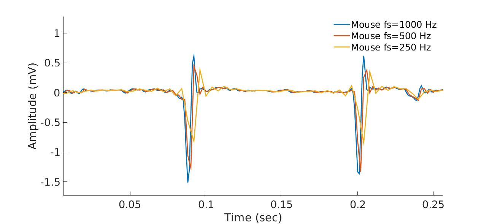
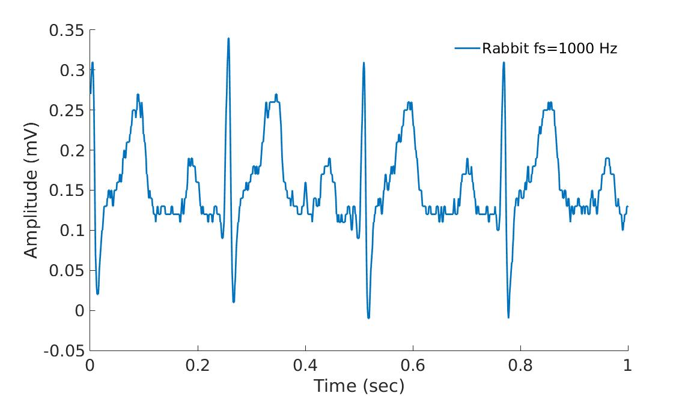

Electrocardiographic recordings
====================

To work with electrophysiological signals they need to be digitized. 
For that purpose both the range and domain need to be digitized. Important attention should be given to the sampling frequency and quantization level in order to ensure the integrity of the data and a meaningfulness HRV analysis.

Sampling frequency and quantization level
~~~~~~~~~~~~~~~~~~~~~~~~~~~~~~~~~~~~~~~~
Sampling refers to the process of discretizing the time domain. 
The sampled time domain will be described by the sampling frequency (fs) 
corresponding to the number of samples per second. The resulting digital 
signal will have a discrete time domain.

Quantization refers to the process of constraining an input from a continuous 
signal to a discrete set of values. The resulting digital signal will have a discrete range.

The sampling frequency and the quantization that are used for recording data will affect the 
quality of the HRV analysis and thus it is important to inspect the raw data 
that are being recorded and eventually, when necessary, adjust the sampling 
frequency and quantization level of the recording device.

Examples of typical issues
~~~~~~~~~~~~~~~~~~~~~~~~~~~~~~~~~~

The following example shows what happens when a mouse ECG recording is downsampled from 1000 Hz to 500 Hz and 250 Hz thus simulating the type of signal you would record if your original sampling rate was below 1000 Hz. As you will observe the exact peak location is affected in an important manner by the sampling frequency. It is degraded at 500 Hz and at 250 Hz it will be very poor. Thus for mouse, 1000 Hz is really the minimal sampling frequency to use in order to ensure a meaningful HRV analysis. However, note that the adequate sampling frequency will be mammal specific.

The following example shows a rabbit recording where the quantization level was poorly set. This can be observed by the low discretization levels / high amplitude `jumps' between consecutive samples. A poor quantization can affect the HRV analysis (as well as any morphological analysis).

