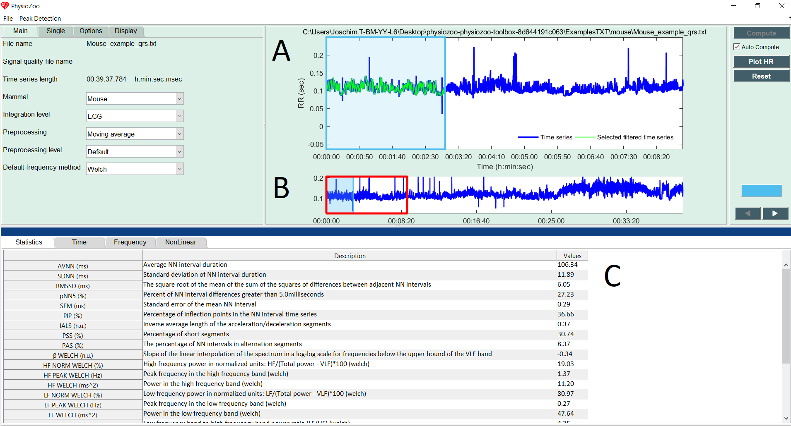
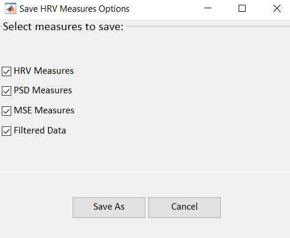
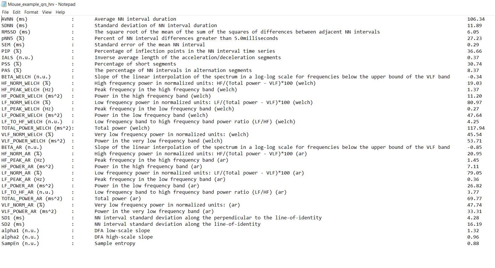

Heart Rate Variability analysis
==========

In this tutorial you will learn how to compute the Heart Rate Variability (HRV) measures and export the computed values within the **PhysioZoo** ``HRV analysis`` module. You will learn how to analyse a single window of defined length and a series of consecutive windows.

**Introduction**
----------------------

HRV analysis is particularly interesting because it provides a non-invasive way to monitor cardiac function and the autonomic system activity. In particular, in the context of animal studies, HRV tools can be used to study the effects of mutations and pharmacological treatments. **PhysioZoo** provides the framework and tools for performing HRV analysis from Humans and animal models data.

**Why mammal specific HRV?**
----------------------
Because the heart rate range, dynamics and autonomic control can vary significantly between mammals, some HRV measures need to be adapted to the mammal which data are analyses. As an example, the following figure illustrates the important differences in the location of the characteristic power spectral peaks in analysing RR time series from different mammals using power spectral analysis. This highlghts the need to re-define the spectral bands (VLF, LF and HF) for each mammal. 

.. image:: ../../_static/Figure_2.png
   :align: center

**Performing HRV analysis**
------------------------------

Start by loading some example data by clicking File -> Open data file -> mouse/Mouse_example_qrs.txt. The program will start the analysis automatically and display the following window:

On the upper figure (A) the selected window (colored in blue) defines the time interval for which the HRV measures are computed. On the lower pannel (B), the RR time series is plotted. Two windows are drawn on it: one window with a red frame and one with a blue frame (and alpha color from within.) The red window defines the part of the RR time series which is plotted on the larger upper figure (A). The blue frame defined the part of the RR time series for which the HRV measures will be computed. The window can be modified (extended/shrank/moved) using the mouse. Pannel (C) shows all the HRV measures that have been computed.

Congrats! You have made your first HRV analysis with **PhysioZoo**!

.. note:: Every time you move the analysis window to another location the newly selected segment will be automatically analyzed. You can disable this by deselecting the checkbox “Auto Compute” located under the “Compute” button.

.. note:: The length of the selected window is important. A number of HRV measures assumes that the RR time series is stationary over the selected window. In our context stationary means that the statistical properties of the RR time series (such as mean and standard deviation) are about constant. Other measures such as the detrended fluctuation analysis ones do not assume stationarity and thus a long window may be used.

**Exporting HRV measures**
--------------------------------------------

You can export the HRV measures and prefiltered NN intervals generated by **PhysioZoo**. Go to File -> Save HRV measures. The following window will display:

You can select the computation(s) you want to save with the checkboxes:

- **HRV Measures**: The HRV measures as displayed in the 'Statistics section' of the user interface.

- **Power Spectral Density**: the measure of signal's power content versus frequency. This corresponds to saving the power content for each frequency bin of the power spectral density displayed under the 'Frequency tab'.

- **Multi Scale Entropy**: the value of sample entropy for a range of scales as specified under Options->NonLinear and displayed under the 'NonLinear tab'.

- **Preprocessed RR intervals**: the RR interval time series after it was preprocessed by the filter you specified under Main-> Preprocessing. The resulting preprocessed time series is traditionally called the 'NN' time series.

Select the location where you want to save the HRV measures. Open the HRV Measures file and you will see the list of HRV measures together with their definitions and values for the window that was selected. For that purpose open the text file (Mouse_example_qrs_hrv.txt) you just saved.

**Exporting figures**
--------------------------------------------

Figures can be exported in high quality format and thus easily included in your research reports or papers. For exporting figures click File -> Export figures. You will be prompted with the following window on which you can choose what figures you want to export. After clicking 'Save As' you will be able to choose the format of the figure.

.. image:: ../../_static/hrvanalysis_figure_exp.png
   :align: center

**Consecutive windows analysis**
--------------------------------------------

You might want to track the evolution of the HRV measures over time. For example if you are injecting some drug to the mammal and want to observe the resulting changes on the HRV measures over time. For that purpose **PhysioZoo** enables to perform the analysis on consecutive segments.

Let’s use a long RR time series: File -> Open data file -> Mouse_example_qrs

Click the “Single” Submenu in the left panel and click on the "Use full length" button. Then press the “Compute” button located on the top right of the interface. You will see the following screen which contains all the HRV measures for each consecutive window over the whole recording.

.. image:: ../../_static/hrvanalysis_multiple.png
   :align: center

You can also enable the analysis window to be overlapping by using the “Overlap” entry in the Analysis menu. By default the value is 0% (i.e. no overlap between successive windows). Change it to 50% and re-run the analysis.

You can export all HRV measures from all consecutive windows (Main -> Save HRV measures as).

If you want to export figures, then select with the mouse the window you want to save the figures for.

.. note:: While using the successive segment analysis feature, it is possible to export the HRV measures and PSD from all the analyzed consecutive windows together. However, you can only export the figures from one single window at the time i.e. from the window that you select with the mouse (i.e. the ‘selected window’).

