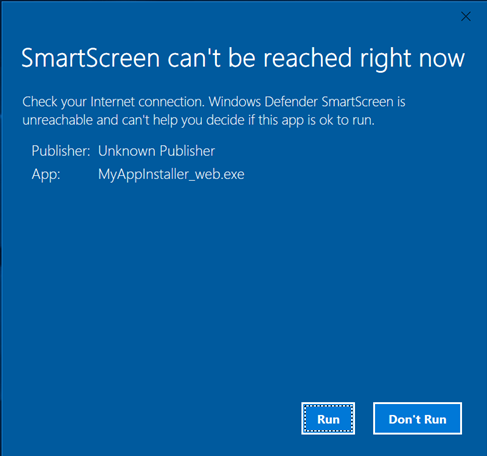
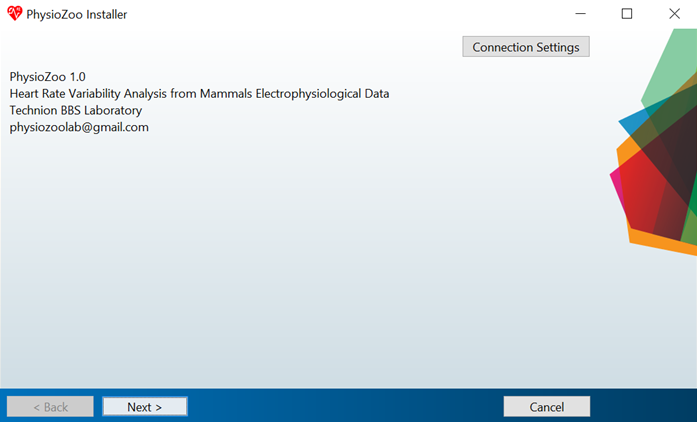
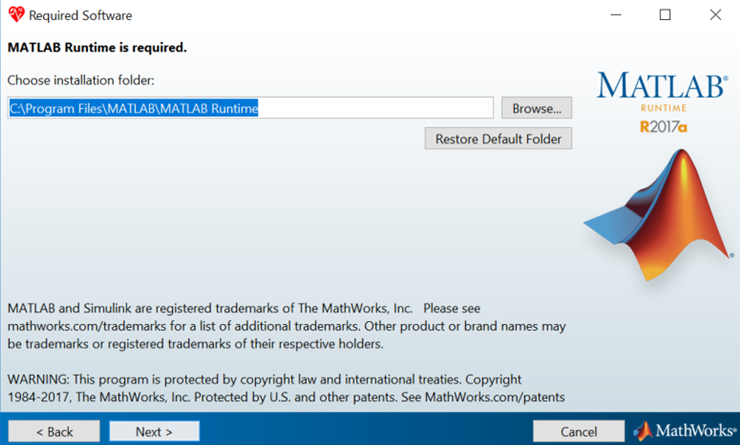
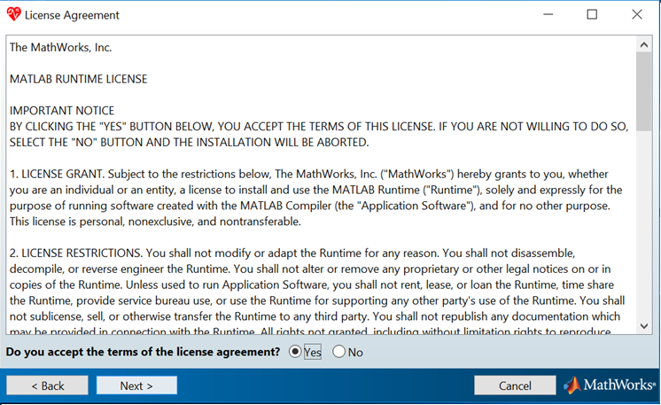
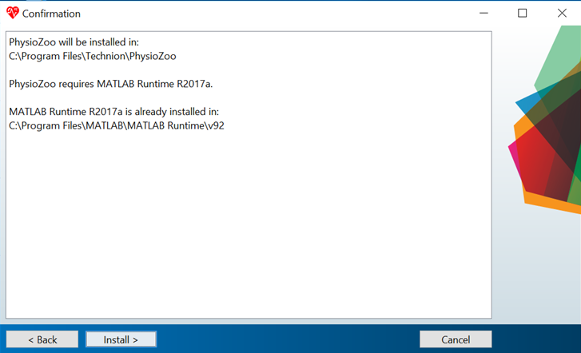
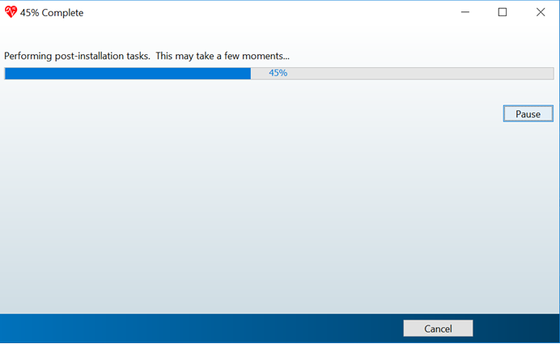
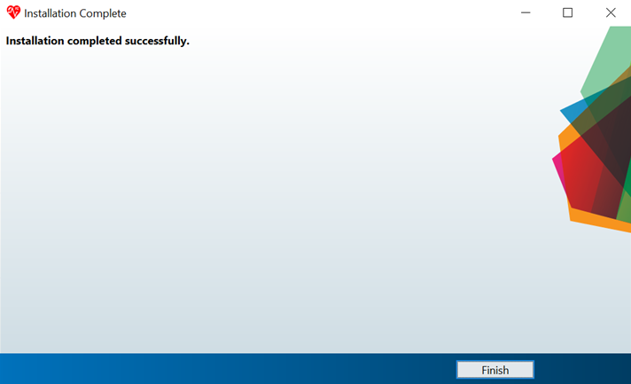

Installing PhysioZoo
====================

``PhysioZoo-UI`` can be run from Matlab or be installed as a standalone application. If you do not need the graphic user interface then you can directly download the hrv source code (``mhrv`` toolbox). The current version was tested for Matlab 2016a and above running on Windows. 

PhysioZoo ``mhrv`` (source code) toolbox
~~~~~~~~~~~~~~~~~~~~~~~~~~~~~~~~~~~~~~~~
Versions supported: MATLAB 2016a and above

`Documentation <https://physiozoo.readthedocs.io/en/latest/#>`_

Download the ``mhrv`` toolbox and follow the set-up instructions.

Running ``PhysioZoo-UI`` in Matlab
~~~~~~~~~~~~~~~~~~~~~~~~~~~~
Versions supported: MATLAB 2016a and above

`Documentation <https://physiozoo.readthedocs.io/en/latest/#>`_

1)	Download the source code

2)	From MATLAB launch PhysioZoo by running the file "PhysioZoo.m"

Stand alone ``PhysioZoo-UI`` executable
~~~~~~~~~~~~~~~~~~~~~~~~~~~~
Operating system: Windows 10 (and above), 64 bits

`Documentation <https://physiozoo.readthedocs.io/en/latest/#>`_

After downloading the software click the “MyAppInstaller_web.exe” file. This will start the installation process. You can then go through the following steps.

Note: some of the screen might be slightly different depending on the version of Windows you are using or whether you already have the MATLAB runtime compiler installed.

1)	If you get the following screen displayed then click “Run”

2)	When the following screen is prompted then click “Next”

3)	When the following screen is prompted then click “Next”

4)	When the following screen is prompted check the “Yes” and then click “Next”

5)	When the following screen is prompted then click “Install”

6)	The installation will start. Wait until it is finished. Note that this might take quite some time.

7)	When the installation is finished it will show the following screen.

You can then click on the **PhysioZoo** logo located on your desktop or in the list of programs.
