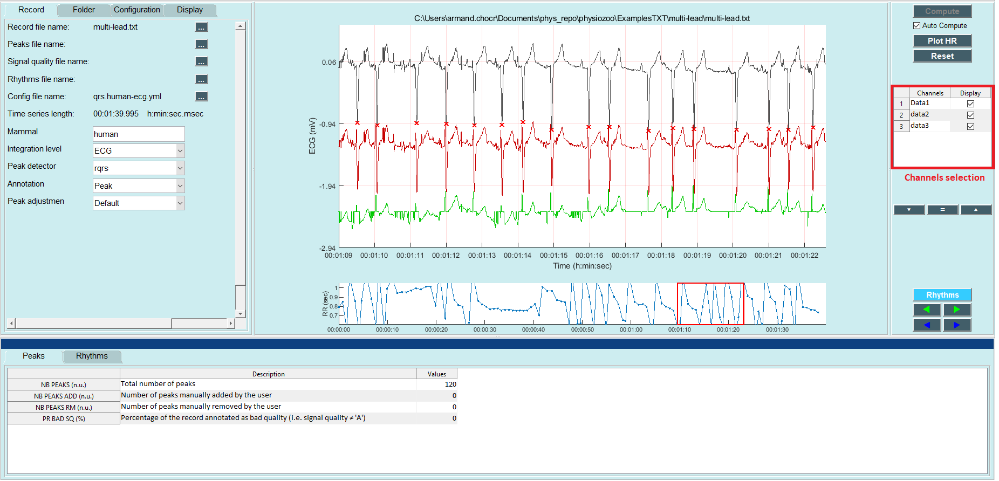

Multi-channel visualization
==========

In this tutorial you will learn how to visualize several ECG channels within the **PhysioZoo** ``Peak detection`` module. 

**Introduction**
----------------------

**PhysioZoo** allows you to visualize several ECG channels in parallel. This can be use to facilitate the review of Holter recordings for example. This tutorial will show how to display several channels in parallel.

**Displaying several channels**
----------------------------
To display several channels of an ECG, follow these steps:

	1. Select the multi-channel ECG example: File-> Open data file-> physiozoo\\ExamplesTXT\\multi-lead\\multi-lead.txt.

	2. On the right panel, select the desired leads to be displayed. By default, only channel 1 is selected. 

   
**Frequently asked questions**
----------------------------

**What is the format of the files to be loaded to PhysioZoo to display several channels ?**
~~~~~~~~~~~~~~~~~~~~~~~~~~~~~~~~~~~~~~~~~~~~~~~~~~~~~~

If recordings are provided in .mat format then each column will represent a different channel. 

An other option is to use a .txt file which will contain the following header: 

|	---
|	Mammal:            **Mammal type (human, rabbit...)**
|	Fs:                **Sampling frequency**
|	Integration_level: electrocardiogram
|	
|	Channels:
|	
|	    - type:   electrography
|	      name:   **Channel name**
|	      unit:   **Units (usually mV)**
|	      enable: yes
|	 
|	    - type:   electrography
|	      name:   **Channel name**
|	      unit:   **Units (usually mV)**
|	      enable: yes
|	
|	    - type:   electrography
|	      name:   **Lead name**
|	      unit:   **Units (usually mV)**
|	      enable: yes
|	---
|	
| Following this header, the user shall place the samples in 3 distinct columns, separated by a space. The user is invited to open the 'multi-lead.txt' example to visualize the file structure. 
