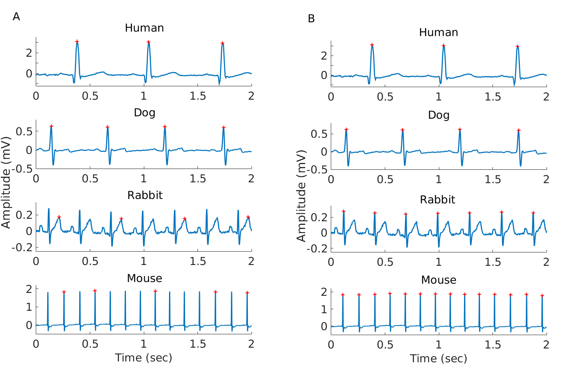
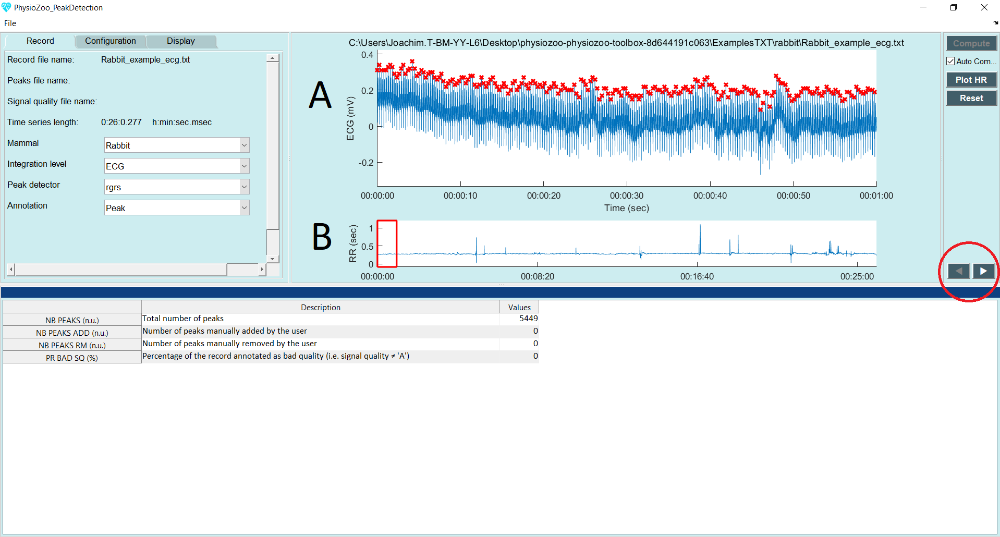
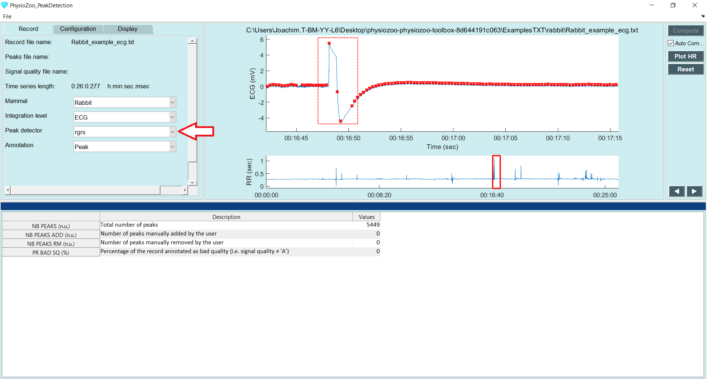
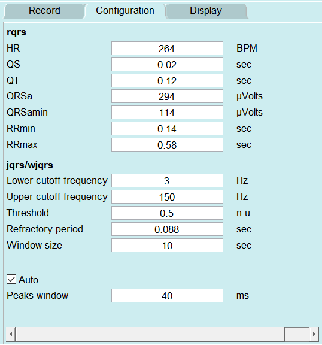

Peak detection
==============

In this tutorial you will learn how to load an electrocardiogram (ECG) recording and perform R-peak detection. You will also learn how to manually correct misdetected peaks. Peak detection is performed in the ``Peak detection`` module.

**Introduction**
---------------------
Accurate peak detection is critical for performing meaningfull HRV analysis. **PhysioZoo** provides a module to perform accurate peak detection from different mammalian species and the option to manually correct misdetected peaks to ensure the accuracy of the RR time series that will be analysed in the HRV analysis module.

**Why mammal specific peak detection?**
-----------------------------
Numerous algorithms for finding R-peaks in human ECGs have been developped. However, these need to be adapted to the different dynamics accross mammalian species. **PhysioZoo** provides a set of peak detection algorithms (``rqrs``, ``jqrs`` and ``wjqrs``) with parameters preset for human, dog, rabbit and mouse. Suitable parameters for other mammals can be specified by the user from the configuration panel.

Representative example of the R-peaks detected  (A) using the original ``gqrs`` human peak detector and (B) using the ``rqrs`` **PhysioZoo** detector with parameters adapted for the different mammals. This figure illustrates the need for mammal-specific R-peak detectors to ensure a correct evaluation of the RR time series.

**Performing peak detection in PhysioZoo**
-----------------------------

  1. Open the PhysioZoo user interface ``PZ-UI``.

  2. Click "Peak Detection" on the Menu bar to open the peak detection interface.
  
  3. Load an ECG recording (e.g. File -> Open File -> Rabbit_example.txt). The ECG will be displayed. The default R-peak detector (``rqrs``) will run automatically. You will see some red crosses appearing on the ECG signal at the locations that have been detected (panel A).

  4. You can browse through the recording by stretching and moving the red window displayed in panel B. You can also move through the recording by using the arrows circled in red on the right hand side. Finally, you can also use the mouse scroll wheel and Ctrl scroll wheel.

.. warning:: The input ECG data imported in **PhysioZoo** MUST be in mV (i.e. physiological units). The R-peak detector might not run appropriately if the data are not correctly scaled.

**Manual peak correction**
-----------------------------
Sometimes the R-peak detector might make mistakes and miss some R-peaks/detect some points which are not peaks. You can fix these mistakes manually using the **PhysioZoo** interface by using the following functionalities:

  1. Select a part of the ECG which is noisy and where some peaks were misdetected.

  2. Point your cursor on a misdetected peak or at the location where a peak is missing. When you click, **PhysioZoo** will automatically remove/add a peak at this location.
  
  3. If a whole segment contains misdetection and you need to clear all the peaks within this section, draw a rectangle on the area where you want the peaks to be deleted (see dotted rectangle figure below). When you 'drop the rectangle', all the peaks contained within it will be deleted.
  
  4. Save your R-peak time series: File -> Save Peaks.

**Configuration for other mammals**
----------------------------------
The **PhysioZoo** R-peak detectors are readily adapted for human, dog, rabbit and mouse ECG data. If you need to use them on another species then you will need to adapt their parameters accordingly. The parameters for the peak detectors can be found under the "Config Params" tab. You can save the configuration of the peak detectors in order to re-use it by going to File -> Save configuration file.

For ``rqrs``:

- HR: Typical heart rate (beats/min)

- QS: Typical QRS duration (sec)

- QT: Typical QT interval duration (sec)

- QRSa: Typical QRS peak-to-peak amplitude (microVolt)

- QRSamin: Minimum QRS peak-to-peak amplitude (microVolt)

- RRmin: Minimum RR interval ("refractory period", sec)

- RRmax: Maximum RR interval (sec)

For ``jqrs`` and ``wjqrs``:

- Lower cutoff frequency: the lower cutoff frequency of the bandpass filter used to prefilter the ECG (Hz)

- Upper cutoff frequency: the upper cutoff frequency of the bandpass filter used to prefilter the ECG (Hz)

- Threshold: the energy threshold (nu)

- Refractory period: the minimal time interval tolerated between two consecutive peaks (sec)

- Window size: this parameter is only used with ``wjqrs``. This peak detector is applied on consecutive (non-overlapping) windows of size 'Window size' (sec).

..  3. Select the type of mammal the ECG was recorded from. This can be done by choosing the mammal type in the dropdown menu "Mammal".    After selecting the mammal type, the R-peak detector will run automatically. After the R-peak detector has finished running you will see some red crosses appearing on the ECG signal at the locations that have been detected.

Other:

- Peaks window: when manually correcting peaks, this parameter corresponds to the window size for which to look for a local maximum / minimum around the click location.

**Frequently asked questions**
----------------------------------

**What is a suitable sampling frequency for my data?**
~~~~~~~~~~~~~~~~~~~~~~~~~~~~~~~~~~~~~~~~~~~~~~~~~~~~~~~~~~~~~~~~~~~~~

In order to locate the peaks accurately from the electrophysiological signal it is important to work with data sampled at a sufficiantly high frequency. For example, for animal data with a high heart rate such as the mouse ECG, the QRS is only a few milliseconds long (~ 7 ms). Thus even at a relatively high sampling rate such as 1000 Hz the QRS will only be described by very few (~7) samples. See `this tutorial <../tutorials/peakdetection.html>`_ for a visual example.

**What's the difference between peak detectors?**
~~~~~~~~~~~~~~~~~~~~~~~~~~~~~~~~~~~~~~~~~~~~~

Sometime a peak detector will fail to detect the R-peaks. This is due to the fact that these detectors were originally built for human ECG analysis and extended to work with mammalian data. In animal ECGs the position and type (e.g. subcutaneous) of the electrodes are not as standardized as for the uman. For that reason we included a set of three R-peak detectors so that it is possible to change to the one that is performing best for your specific dataset and electrodes configuration.

**How best to deal with long recordings?**
~~~~~~~~~~~~~~~~~~~~~~~~~~~~~~~~~~~~~~

If you deal with long recordings (i.e. hours long) then use ``rqrs`` or ``wjqrs``.

