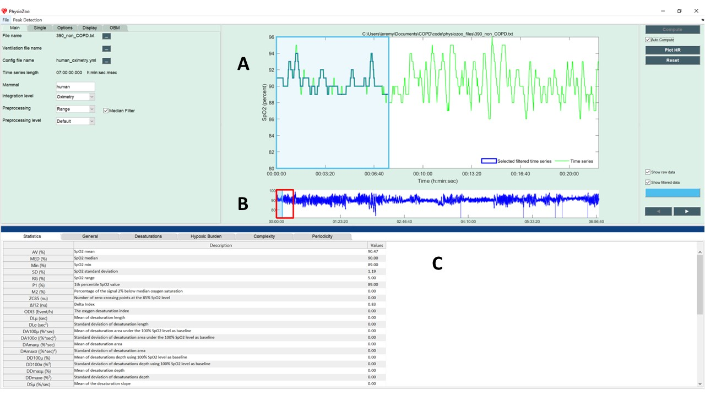

Oximetry time series analysis
==========

In this tutorial you will learn how to compute the oximetry biomarkers and export the computed values within the **PhysioZoo** ``POBM`` toolbox. 

**Introduction**
----------------------

The SpO2 is a measure of the amount of oxygen-carrying hemoglobin in the bloor relative to the amount of hemoglobin not carrying oxygen. The extraction of digital biomarkers from the oxygen saturation time series is a critical step in the process of diagnosis and continuous monitoring of patient pulmonary function. Indeed, studying the variability of the oxygen saturation signal may provide information on the underlying physiological control systems. **PhysioZoo** provides the framework and tools for extracting oximetry biomarkers from the SpO2 signal.

**Performing oximetry analysis**
------------------------------

Start by loading some example data by clicking File -> Open data file -> mouse/Mouse_example_qrs.txt. The program will start the analysis automatically and display the following window:

In the upper figure (A) the selected window (colored in blue) defines the time interval for which the oximetry biomarkers are computed. In the lower panel (B), the overall oximetry signal is plotted. Two windows are drawn on it: one window with a red frame and one with a blue frame (and alpha color from within.) The red window defines the part of the oximetry time series plotted in the larger upper figure (A). The blue frame defines the part of the oximetry time series for which the biomarkers will be computed. The window can be modified (extended/shrunk/moved) using the mouse. Pannel (C) shows all the oximetry biomarkers that have been computed.

Congrats! You have made your first oximetry analysis with **PhysioZoo**!

.. note:: Every time you move the analysis window to another location the newly selected segment will be automatically analyzed. You can disable this by deselecting the checkbox “Auto Compute” located under the “Compute” button.

.. note:: The length of the selected window is important. Some biomarkers necessit algorithm with high complexity, and thus may take some time to run on too long windows. You can modify the size of the window under "Display".

**Exporting oximetry biomarkers**
--------------------------------------------

You can export the oximetry biomarkers and prefiltered SpO2 signal generated by **PhysioZoo**. Go to File -> Save SpO2 measures. The following window will display:

.. image:: ../../_static/pobm_save_measures.PNG
   :align: center

You can select the computation(s) you want to save with the checkboxes:

- **Spo2 Measures**: The 44 oximetry biomarkers computed by the software.

- **Preprocessed SpO2**: the oximetry time series after it was preprocessed by the filter you specified under Main-> Preprocessing. 

Select the location where you want to save the oximetry measures. Open the file and you will see the list of oximetry measures together with their definitions and values for the window that was selected. For that purpose open the text file you just saved.

.. image:: ../../_static/pobm_example_measures.PNG
   :align: center

**Exporting figures**
--------------------------------------------

Figures can be exported in high quality format and thus easily included in your research reports or papers. For exporting figures click File -> Export figures. You will be prompted with the following window on which you can choose what figures you want to export. After clicking 'Save As' you will be able to choose the format of the figure.

.. image:: ../../_static/pobm_save_figures.PNG
   :align: center
