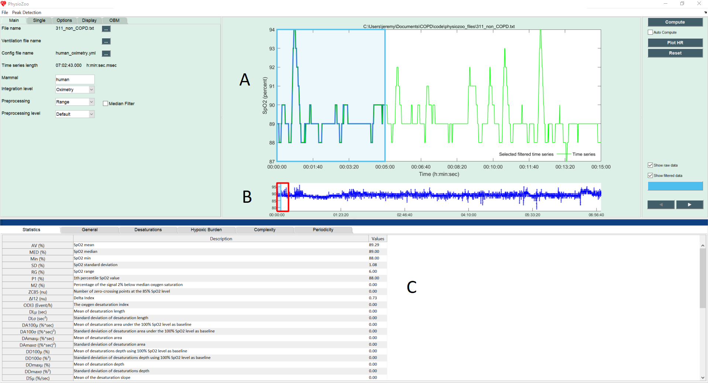
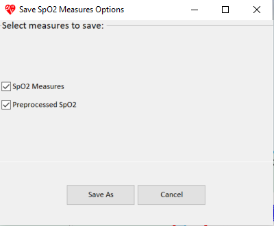
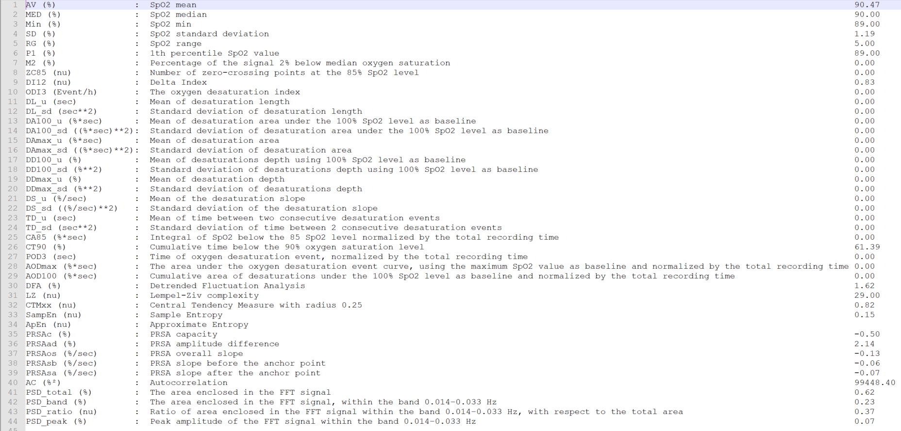
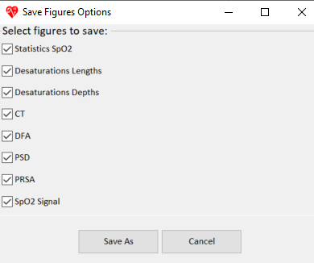
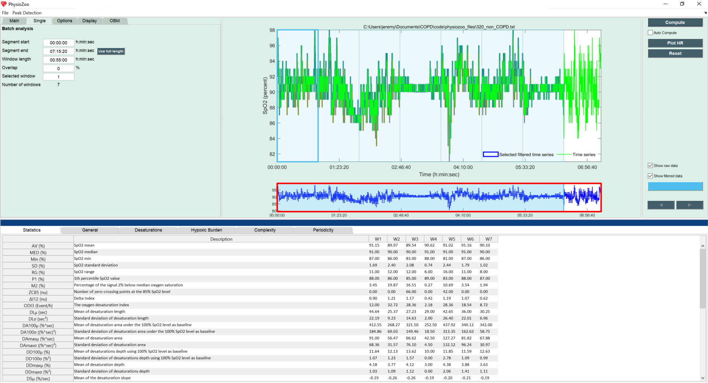

Oximetry time series analysis
==========

In this tutorial you will learn how to use **PhysioZoo OBM** to compute the oximetry biomarkers and export the computed values.

**Introduction**
----------------------
SpO2 is a measure of the amount of oxygen-loaded hemoglobin in the blood, relative to the amount of oxygen-unloaded hemoglobin. The extraction of digital biomarkers from the oxygen saturation time series is a critical step in the process of diagnosis and monitoring of patient pulmonary function. Studying the variability of the oxygen saturation signal may provide information about the underlying physiological control systems. **PhysioZoo OBM** provides the framework and the tools for extracting oximetry biomarkers from the SpO2 signal.

**Performing oximetry analysis**
------------------------------

Start by loading some example data by clicking File -> Open data file -> SpO2/SpO2_example.txt. The program will start the analysis automatically and will display the following window:

Refering to the figure above: (A) the selected window (shaded in blue) defines the time interval for which the oximetry biomarkers are computed. In the lower panel (B), the overall oximetry signal is plotted. Two windows are drawn on it: one window with a red frame and another one with a blue frame (and alpha color from within). The red window defines the part of the oximetry time series plotted in the larger upper figure (A). The blue frame defines the part of the oximetry time series for which the biomarkers will be computed. The two windows can be modified (extended/shrunk/moved) using the mouse. Pannel (C) shows all the oximetry biomarkers that have been computed.

Congrats! You have made your first oximetry analysis with **PhysioZoo OBM**!
The biomarkers are divided into five different categories: General, Desaturations, Hypoxic Burden, Complexity and Periodicity. You can choose to compute only certain categories (to save time), into the tab "OBM".

.. note:: Every time you move the analysis window to another location the newly selected segment will be automatically analyzed. You can disable this by deselecting the checkbox “Auto Compute” located under the “Compute” button.

.. note:: The length of the selected window is important. Some biomarkers are extracted using an algorithm with high computational complexity, and thus may take some time to run on long windows. You can modify the size of the window under "Display".

**Exporting oximetry biomarkers**
--------------------------------------------

You can export the oximetry biomarkers and the prefiltered SpO2 signal generated by **PhysioZoo OBM**. Go to File -> Save SpO2 measures. The following window will display:

You can select the computation(s) you want to save with the checkboxes:

- **SpO2 Measures**: The 44 oximetry biomarkers computed by the software.

- **Preprocessed SpO2**: The oximetry time series after it was preprocessed by the filter you specified under Main-> Preprocessing. 

Select the location where you want to save the oximetry measures. Open the file and see the list of oximetry measures together with their definitions and values for the window that was selected.

**Exporting figures**
--------------------------------------------

Using **PhysioZoo OBM** you can export summary graphs such as the distribution of the time series or histogram of the desaturations characteristics. Figures can be exported in high quality format and thus easily included in your research reports and/or papers. For exporting figures click File -> Export figures. You will be prompted with the following window on which you can choose what figures you want to export. After clicking 'Save As' you will be able to choose the format of the figure.

**Consecutive windows analysis**
--------------------------------------------

You might want to track the evolution of the oximetry biomarkers over the time. For example, when monitoring patients it may be useful to see how the oximetry biomarkers vary over time. For that purpose **PhysioZoo OBM** enables the analysis to be performed on consecutive windows.

Click the “Single” Submenu in the left panel and click on the "Use full length" button. Then press the “Compute” button located on the top right of the interface. You will see the following screen, which contains all the oximetry biomarkers for each consecutive window over the whole recording.

You can also enable the analysis window to be overlapping by using the “Overlap” entry in the Analysis menu. By default the value is 0% (i.e. no overlap between successive windows). Change it to 50% and re-run the analysis.

You can export all oximetry biomarkers from all consecutive windows (Main -> Save SpO2 measures).

If you want to export figures, then use the mouse to select the windows that you want included in the figure.

**Setting biomarker parameters**
--------------------------------------------

The oximetry biomarkers have a number of associated parameters which can be adjusted by the user. For example, desaturations can be detected with a relative threshold of 3% or 5%. In order to change those parameters, click on tab "Options". Six tabs will be shown, one for filtering and one for each of the five categories of biomarkers. After changing the value of a specific parameter, click on "Compute" in order to recompute the biomarkers with the new parameters.
