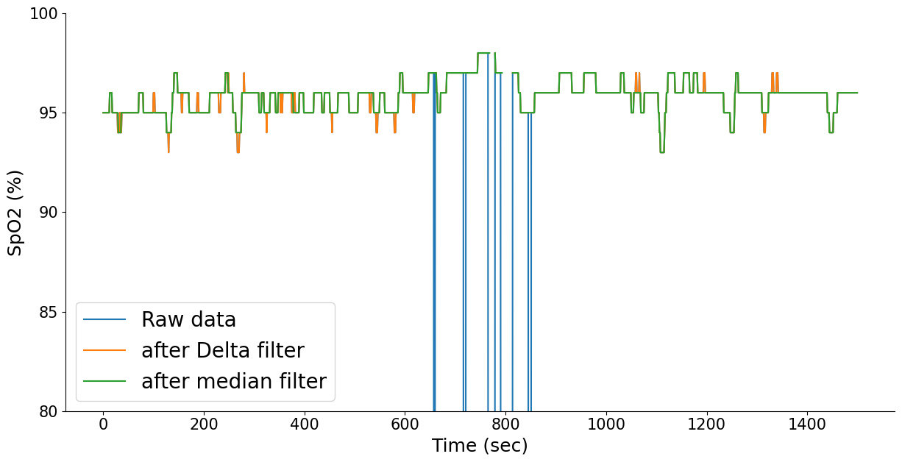
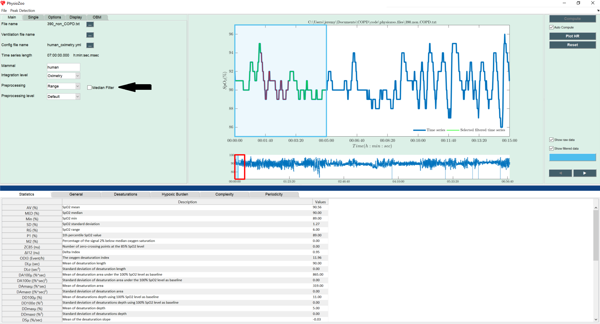

Preprocessing
==========

In this tutorial you will learn how to preprocess your oximetry time series within **PhysioZoo OBM**.

**Introduction**
----------------------

When loading an oximetry time series in **PhysioZoo OBM** the first step is to preprocess your signal to remove abnormal measurements.

We implemented in **PhysioZoo OBM** three methods for pre-filtering the oximetry time series:

  * Range, 
  * Delta Filter,
  * Block of data filter.

In addition, a median filter is available and may be applied to the signal after one of the preprocessing methods.

**Why is preprocessing important?**
----------------------

Raw oximetry data often has missing values and artefacts. Indeed, any motion of the oximeter, or lack of contact between the device and the finger could alterate the signal.

The example below shows an oximetry time series before preprocessing (raw data), after Delta filter and then after median filter. We can see that the raw data contains some non-physiological values (drop to 0) which are removed by the Delta filter. The median filter smoothes the signal.

**Preprocessing methods in PhysioZoo**
----------------------
  
You can select the preprocessing filter with the dropdown "Preprocessing" located under the Main tab. You can then check the box "Median filter", to choose to apply the median filter. If you want to customize the preprocessing further, you can modify the parameters of each preprocessing methods under Options->Filtering.

The image below shows an example of an oximetry time series (the blue signal) which has been filtered (green signal). The resulting preprocessed time series is shown as a green time series, using the Range filter, associated with median filter (as the box median filter is marked with V). The desaturations are highlighted in red.

