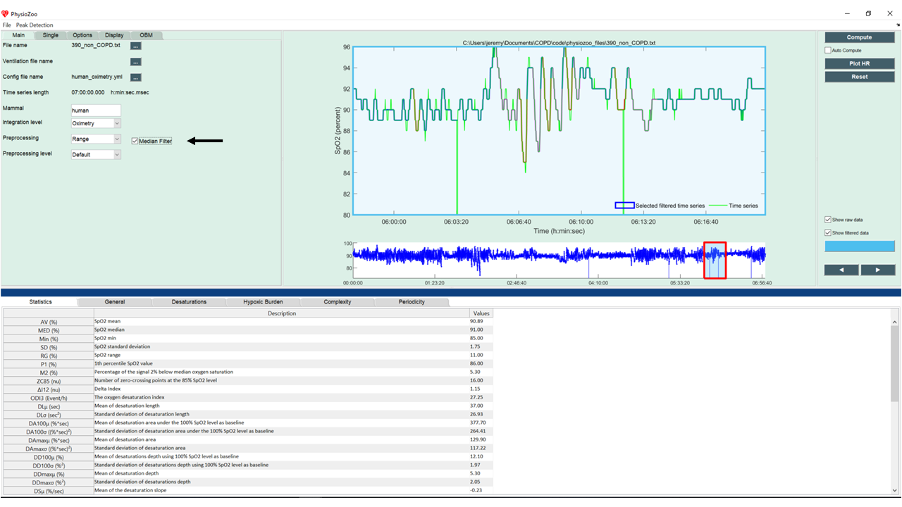

POBM Preprocessing
==========

In this tutorial you will learn how to preprocess your oximetry time series within **PhysioZoo OBM**.

**Introduction**
----------------------

When loading an oximetry time series in **PhysioZoo OBM**, one of the parameters you need to set is the preprocessing method.

We implemented in **PhysioZoo OBM** three methods for pre-filtering the oximetry time series:

  * Range, 
  * Delta Filter,
  * Block of data filter.

Furthermore, an additional filter is available: the median filter, which should be applied to the signal after one of the pre-filtering method.

**Why is preprocessing important?**
----------------------

Raw oximetry data is often associated with missing values and artefacts. Indeed, any motion of the oximeter, or lack of contact between the device and the finger could alterate the signal.

The example below shows an oximetry signal before preprocessing (raw data), after Delta filter and then after median filter. We can see that the raw data contains some non-physiological values (drop to 0) which are removed by the Delta filter. The median filter smoothes the signal, getting rid of sharp values.

.. image:: ../../_static/pobm_preprocessing.png
   :align: center

**Preprocessing methods in PhysioZoo**
----------------------
  
You can select the preprocessing filter with the dropdown "Preprocessing" located under the Main tab. You can then check the box "Median filter", to choose to apply the median filter in addition to one of the pre-filtering technique. If you want to customize the preprocessing further, you can modify the hyper-parameters of each filtering method under Options->Filtering.

The image below shows an example of a oximetry time (blue time series) series which has been filtered over the selected window (green time series) using the Range filter, associated with median filter.

