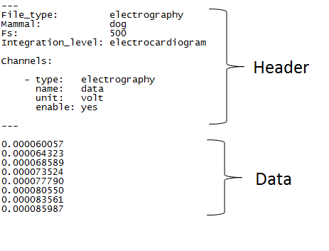
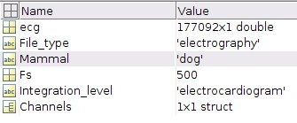
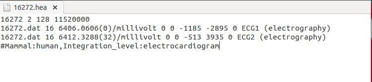

Formats supported
==========

In this tutorial you will learn about how to prepare your data for importing them in **PhysioZoo**.

**Introduction**
---------------------

**PhysioZoo** supports three types of formats: `WFDB <https://www.physionet.org/physiotools/matlab/wfdb-app-matlab>`_, text (.txt) and MATLAB (.mat). The text and mat files structures are specific to **PhysioZoo** whereas the WFDB follows the standard structure of WFDB powered by Physionet (physionet.org) with some additional fields in the WFDB header files. If you are experienced with WFDB then we recommend you use this format.

For any of the three formats a file consists of a header and the data:

**General structure of the header**
---------------------

For each of the files the following information can be specified in the header:

  * Mammal: the name of the mammal (e.g. dog, mouse, rabbit, human),
  * Fs: the sampling frequency in Hertz,
  * Integration_Level: electrocardiogram, electrogram or action potential.

As part of the header, information characterizing each channel available can be entered:

  * type: peak, signal quality, time, interval, beating rate and electrography. See definitions of these in the next section,
  * name: a name you want to give to the channel (of note this information is not used by the `PZ Loader <../tutorials/pzloader.rst>`_ to load the data),
  * unit: millisecond, second, index, bpm, millivolt, microvolt and volt,
  * enable: 'yes' or 'no'. If you specify 'no' then this channel will be ignored when the file is loaded by the PZ Loader. Only specify 'yes' for the channels you want to use.
  
In the case all or part of these information are not specified then you will be prompted to enter them though the `PZ Loader <../tutorials/pzloader.rst>`_.

**Channels Type**
---------------------

There are two categories of Channels: `Annotations' and `Timeseries'. Within these two categories the Channel can be one of the following `type' (specified in the header) which will be handled by **PhysioZoo**:

Annotations
  * peak: the location of the peaks (e.g. R-peak from an ECG time series). The peaks location can be specified in millisecond/second or index.
  * signal quality: annotation on the signal quality. The signal quality annotations can be specified in millisecond/second or index.

Time series
  * time: a time vector giving the position of each sample of another time series. An entry of type `time' need to be associated with another time series and must be in units of seconds or milliseconds.
  * interval: the time interval between consecutive beats (e.g. RR time series). The interval length can be specified in second/millisecond or index.
  * beating rate: the reciprocal of the interval in units of beats per minute (e.g. heart rate).
  * electrography: the amplitude of an electrography time series (e.g. ECG). The electrography amplitude is given in microvolt, millivolt or volt. Thus only physiological units are allowed.
  
**Headers in the different formats**
------------------------------------------

Explanation of the structure of the different format supported is provided below. Examples in all formats are also available in the `Examples' folder provided with **PhysioZoo**.

**Text format (.txt)**

**Matlab format (.mat)**

A .mat file need to contain the following fields:

The Channels field is a Cell. Each element of the Channel Cell will contain the following fields : type, name, unit and enable.

**WFDB (.hea)**

WFDB files (annotation or data) will be accompanied by a header (.hea) file specifying the relevant information for reading an annotation or data file. Refer to the `WFDB <https://www.physionet.org/physiotools/matlab/wfdb-app-matlab>`_ documentation for that. To the standard WFDB format of the header, you will need to add one comment line at the end of the header and starting '#' then followed by the mammal type and the integration level. In addition, you need to specify for each channel the type of data that is represented ('electrography' on the example below).

  
  
