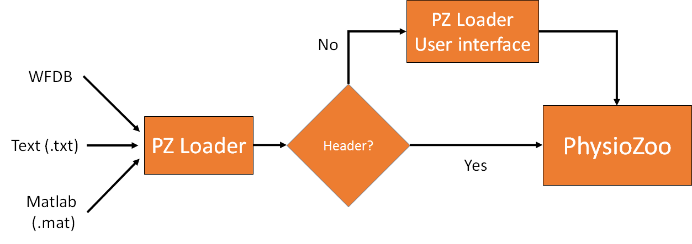
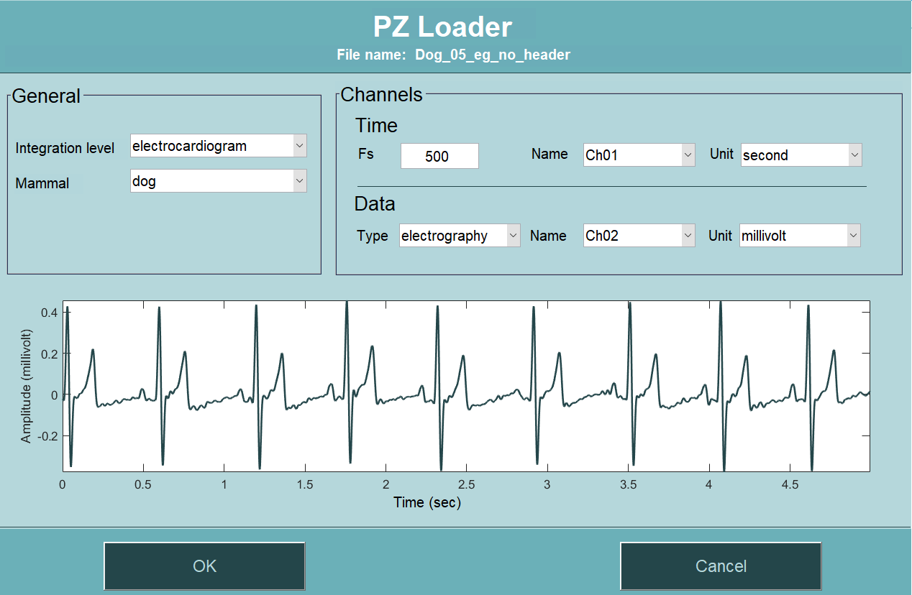

Importing data
==========

In this tutorial you will learn how to import data in **PhysioZoo**. 

**Introduction**
---------------------

Data loading in **PhysioZoo** is centralized and done through the ``PZ Loader`` tool. Three types of input formats are supported by **PhysioZoo** - see `formats supported <../tutorials/pzformats.html>`_. 

**Concepts**
---------------------
- ``PZ Loader``: three types of formats can be loaded in **PhysioZoo**. This is done through the ``PZ Loader``. The ``PZ Loader`` will ensure that the data that enter the ``PZ-UI`` are properly formatted.

- Header: it is possible to include a header at the beginning of a record. This header will specify all the information that **PhysioZoo** needs to open a record. If all the information is specified in the header, then you will not need to go through populating the ``PZ Loader`` User Interface and the record will be directly opened in **PhysioZoo**. 

See `here <../tutorials/pzformats.html>`_ for the formats supported and how to create **PhysioZoo** headers.

The figure bellow illustrates the pathway for loading a recording: the ``PZ Loader`` is used to load a recording from one of the supported formats. If no header is available, then the ``PZ Loader`` user interface is opened and the user is prompted to enter the necessary information. If the header is available, then the record is directly loaded in **PhysioZoo**.

In this tutorial we will see how to make use of the ``PZ Loader`` user interface (UI) when no header is available.

**PZ Loader User Interface**
---------------------

Open an example annotation file:

Download the following `example <../../_static/Dog_05_eg_no_header.txt>`_ file and load it in **PhysioZoo**.

In case some information are missing from the file (e.g. mammal type is not available in the header) then the ``PZ Loader`` will request the corresponding fields to be filled by the user. 
When all the fields have been filled then click OK and the data will be opened in **PhysioZoo**.

For the example provided, fill the fields as in the screenshot below and click OK:

.. **Saving a file with a header**
.. ---------------------

.. In the case where you will need to re-load the same file later on then after filling the fields of the ``PZ Loader`` you can click 'Save As'. This will save your file with a header which will contain all the information you filled in the ``PZ Loader``. When you will load this file again then you will not need to fill the fields again. 

.. Here is an example to illustrate that. First using a text editor open the following `example <../../_static/Dog_example_ecg_no_header.txt>`_ file.

.. You will see the following file which consists of a time series. There is no information on what this time series is and neither its units, sampling frequency etc. 

.. .. image:: ../../_static/PZ_Loader_eg.PNG
   :align: center

.. Now load the same example using the ``PZ Loader``.

.. This file has no header and you will need to enter the necessary information on the ``PZ Loader`` interface. Enter the following information:

..  * Integration_level: electrocardiogram
  * Mammal: dog
  * Fs: 500
  * Type: electrography
  * Unit: millivolt

.. Then click "Save As" and save the file under the name "PZ_Loader_eg_with_header.txt". Open the text file with a text editor. You will see on your screen the following:

.. .. image:: ../../_static/PZ_Loader_eg_with_header.PNG
   :align: center

.. The time series was saved with its header consisting of all the information you entered using the ``PZ Loader``. Next time you will need to load this file you will not need to re-fill the ``PZ Loader`` UI fields. They will be populated automatically from the header.

.. Check it for yourself!

