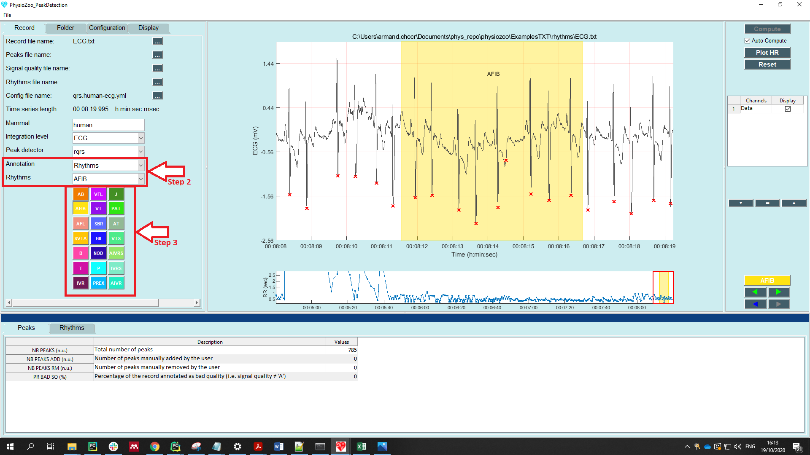
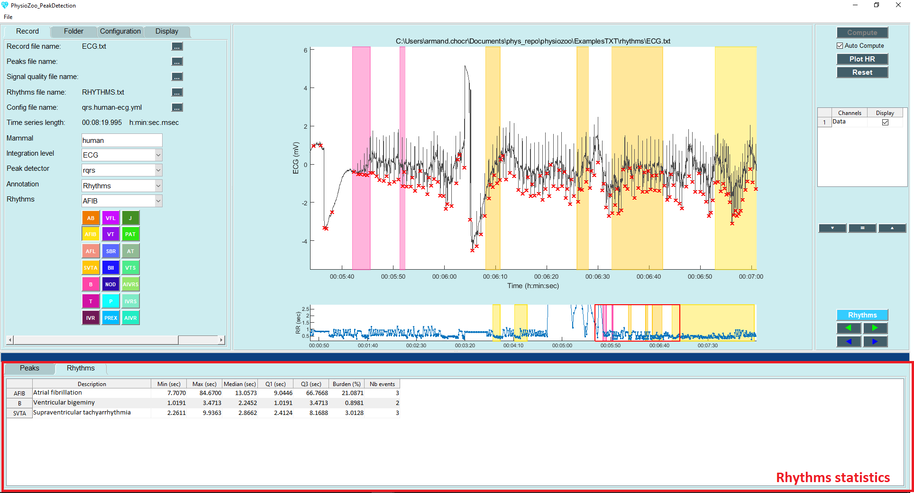

Rhythm annotations
==========

In this tutorial you will learn how to perform rhythms annotations from raw ECG recording within the **PhysioZoo** ``Peak detection`` module.

**Introduction**
----------------------

**PhysioZoo** enables you to annotate and load rhythm annotations i.e. timestamped rhythm annotations marking the beginning and the end of a given rhythm. For example, rhythm annotations may have been produced by an original automated analysis machine (e.g. Holter ECG software) that you which to review and edit. The heart rhythms for wish annotations exist in **PhysioZoo** are: 

.. raw:: html

    
	
	
	
	
	
	
	
	
	
	
	
	
	
	
	
	
	
	
	
	

.. role:: ab
.. role:: afib
.. role:: afl
.. role:: svta
.. role:: b
.. role:: t
.. role:: ivr
.. role:: vfl
.. role:: vt
.. role:: sbr
.. role:: bii
.. role:: nod
.. role:: p
.. role:: prex
.. role:: j
.. role:: pat
.. role:: at
.. role:: vts
.. role:: aivrs
.. role:: ivrs
.. role:: aivr

.. list-table:: Available rhythms in **PhysioZoo**
   :widths: 25 25 
   :header-rows: 1
   :align: center

   * - Abbreviation
     - Condition
   * - :afib:`AFIB`
     - Atrial fibrillation 
   * - :ab:`AB`
     - Atrial bigeminy
   * - :afl:`AFL`
     - Atrial flutter
   * - :b:`B`
     - Ventricular bigeminy
   * - :bii:`BII`
     - 2° heart block
   * - :ivr:`IVR`
     - Idioventricular rhythm
   * - :nod:`NOD`
     - Nodal (A-V junctional) rhythm 
   * - :p:`P`
     - Paced rhythm
   * - :prex:`PREX`
     - Pre-excitation (WPW) 
   * - :sbr:`SBR`
     - Sinus bradycardia 
   * - :svta:`SVTA`
     - Supraventricular tachyarrhythmia 
   * - :t:`T`
     - Ventricular trigeminy 
   * - :vfl:`VFL`
     - Ventricular flutter 
   * - :vt:`VT`
     - Ventricular tachycardia 
   * - :j:`J`
     - Junctional rhythm 
   * - :pat:`PAT`
     - Paroxysmal atrial tachycardia
   * - :at:`AT`
     - Atrial tachycardia
   * - :ivr:`IVR`
     - Idioventricular rhythm 
   * - :aivr:`AIVR`
     - Accelerated idioventricular rhythm 

**Annotating rhythms**
----------------------------
To annotate the quality of an electrophysiological signal time series, follow these steps:

	1. Select the following ECG example: File-> Open data file-> physiozoo\\ExamplesTXT\\rhythms\\ECG.txt.

	2. Under the record panel, select Annotation -> Rhythms. See the red rectangle on the figure below. The different options will be displayed below in the same panel. 

	3. Draw a rectangle with your mouse on the desired window. The background behind the selected window will be displayed in color.

	4. The rhythms can be exported under a .txt file: File -> Save Rhythms file (Ctrl+T). 

**Loading rhythms**
----------------------------

When using a recording for which you have performed rhythms annotations, you can load the rhythms annotations: Open -> Open rhythms file.

After the rhythms annotations are loaded, you will see a set of shaded areas with different colors appearing on the top of the RR interval time series figure as well as on the ECG raw data. These areas correspond to the rhythms annotations and each color is used to represent a different rhythm. These annotations may be further edited/saved.

On the bottom panel, you can find summary statistics for each rhythm: burden, minimal interval length, maximal interval length and 5 summary statistics.

